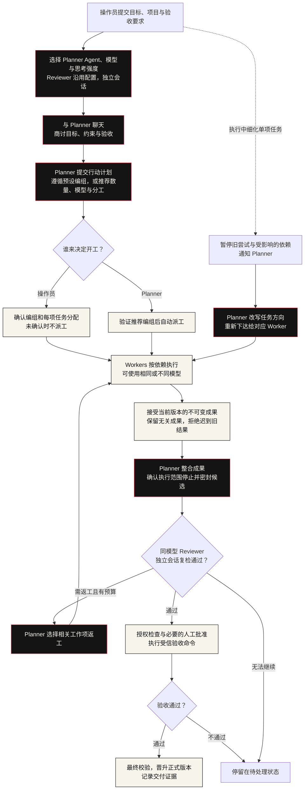
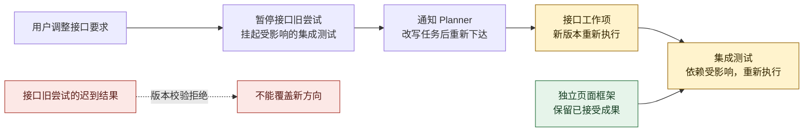

# Agent Foundry Next

[](https://github.com/rejec-rot/agent-foundry-orchestrator/actions/workflows/regression.yml?query=branch%3Amain)

面向共享目标的多 agents 协作平台：先选择 **Planner 的 Agent、模型与思考强度**，通过聊天形成计划，由操作员或 Planner 决定 **1–8 位 Worker 的数量、模型、思考强度和分工**；Planner 所选配置同时用于 **Reviewer 的独立复检会话**。执行中调整单项工作，会先暂停受影响的尝试，经 Planner 改写后重新派工。**Trusted Import V2** 负责成果的独立评审、授权、验收与正式代码提升。

当前版本：`2.0.0-dev`。方案二的首期协作核心已实现，入口是 **`/teams.html`** 和 **`af-admin team`**。历史单作者 V2 链路完成过本地 Docker 部署验收及 Codex＋Cline 冒烟；新团队链路的真实模型账号联调仍需单独验收。

项目源自 `opperl1114/agent-foundry-orchestrator` 的 `434114e`（v1.2.0），是独立升级线。许可仍为 `UNLICENSED`，公开发布条件见 [NOTICE.md](NOTICE.md) 和 [ADR-0003](docs/adr/0003-upstream-license-unresolved.md)。

## 新人先看：一个目标怎样完成

创建页只需填写目标、项目并选择 Planner 的 Agent、模型与思考强度；开工授权和验收参数放在“更多设置”。协作页的 Planner 面板也可直接选择这三项，“你的团队”旁的“选择 Worker Agents”可预设每位 Worker 的配置。保存配置后，先与 Planner 商讨边界和验收，再生成行动提案。未预设时由 Planner 推荐编组，你确认或调整后开工；也可授权 Planner 自动开工。Planner 整合成果后，同配置 Reviewer 通过独立会话复检，交付服务继续授权、验收和正式提升。

下面的 Mermaid 流程图可在 GitHub README 中直接查看。主线按从上到下阅读，虚线表示用户介入与成员通信。不支持 Mermaid 的阅读器可打开[协作流程 SVG](docs/diagrams/team-workflow.svg)。



这张图描述正常协作与交付路径。授权未通过、整合发生冲突、执行预算耗尽或旧执行范围无法确认时，系统会停留在相应待处理状态；不会绕过检查直接交付。

## 谁负责什么

| 角色 | 职责 |
|---|---|
| 用户 | 定义目标与验收要求，查看进展，调整工作方向、改派、暂停或取消，处理人工审批 |
| Planner | 与操作员商讨，规划工作图与编组，接收改向请求，协调成员与整合成果，根据复检反馈选择局部返工 |
| Workers | 完成各自工作项，向成员提问或回复，提交可追踪的成果 |
| 团队控制器 | 管理调度、消息、版本、运行记录与恢复；这是后台服务，不是模型成员 |
| Reviewer | 使用 Planner 所选的执行器、模型与思考强度，建立独立会话审查密封候选；复检会话不得复用 Planner 或 Worker 的会话 |
| Trusted Import V2 | 承接代码交付，检查授权、执行验收并晋升正式版本 |

创建时内部默认参考编组三位 Worker，页面不要求提前决定人数；可选的 Worker 配置入口允许提前预设 **1–8 位 Worker**，也可等计划形成后再确认。Planner 与 Reviewer 使用同一模型与思考强度配置，承担不同角色。每位 Worker 可独立选择 Agent、模型与思考强度。成员身份与执行器、模型账号、CLI 会话分别记录；成员数量不等于不同账号的数量，也不保证所有成员同时执行。

商讨阶段修改配置并保存不会启动任务。已开工的团队先暂停并确认运行范围停止，再修改成员配置；新配置用于后续尝试，保留其他成员已接受的成果。派工后不能通过配置入口改变人数。每次保存和确认均校验配置版本，Reviewer 在交付时读取最新 Planner 配置并建立独立会话。

## 中途改需求会怎样

例如，Planner 把登录功能分成接口、独立的页面框架和集成测试。这里假定页面框架不依赖接口实现，集成测试依赖二者。你提交接口改向后，先停止旧接口尝试并挂起受影响的测试，再通知 Planner。Planner 改写任务后重新派工，页面框架成果保留。



也可直接打开[局部返工 SVG](docs/diagrams/team-rework.svg)。是否保留成果由工作图的实际依赖决定。页面和命令行通过 `queued`（已排队）、`received`（已接收）、`applied`（已落实）区分操作回执；成员消息的领取和落实以受控执行记录为依据。消息在下一轮执行时领取，目前不支持运行中的即时注入。

## 从哪里开始

1. 阅读上面的流程和[当前能力与边界](#当前能力与边界)，了解协作与交付分别负责什么。
2. 按[环境与配置](#环境与配置)准备 Node.js、Git、执行器认证与隔离；配置项目注册表和受信验收 profile。
3. 按[团队入口](#团队入口)创建并启动目标，在 `/teams.html` 查看分工、依赖、消息、成果和交付状态。
4. 开发者从 `lib/team/`、`server/read-api.mjs` 和 `tests/team-*.test.mjs` 开始；部署与恢复参考[运维手册](OPERATOR_RUNBOOK.md)。

## 当前能力与边界

| 能力 | 当前状态 |
|---|---|
| 团队协作 | 常驻控制器、Planner 对话、计划确认与 1–8 个注册 Worker、工作依赖、独立尝试与不可变产物 |
| 成员通信与人工调整 | 版本化消息、成员回复、工作项改派、定向失效、queued/received/applied 回执 |
| 团队恢复 | 租约与提交序号、指令去重、已确认 scope 的中断恢复；未知写者阻止重跑与交付 |
| V2 主入口 | 显式设置 `trusted_import.enabled: true` 后启用 |
| 独立评审 | 显式指定独立 reviewer，评审密封候选快照 |
| 捕获与授权 | 文件系统捕获、内容寻址存储（CAS）、快照、差异及累计授权闭包 |
| 验收与提升 | 白名单命令、PASS 证据绑定、最终重新校验、Git 原子提升 |
| 并发与恢复 | 旧基线重基、同路径冲突拒绝、提升后崩溃恢复与祖先关系校验 |
| 写者回收 | Docker 或 delegated cgroup；进程组退出本身不证明所有写者已停止 |
| 持久化回收 | 未确认 scope 清空时保留句柄；dry-run 不执行 scope 回收 |

Trusted Import 交付服务接纳 `workspace` 代码成果；团队的工作图、通信和调整由协作控制器管理。独立评审反馈能返回 Planner 选择局部返工，签名审批通过正常入口恢复。旧历史任务保留原流程；新的团队任务由兼容入口转交协作控制器，旧 scheduler 不能再直接派发。

## 团队入口

浏览器默认进入 Persona 5 视觉风格协作空间：红黑白、斜切海报排版、原创面具、漫画对话气泡、行动卡片和四步流程条。协作空间与交付工作台共用本地加载的 Anton、Space Grotesk 和得意黑，以及带错位底板、箭头区和按压反馈的按钮。Planner 对话常驻左侧，计划与派工确认集中在右侧；创建目标、Worker 编组、定向调整和运行记录使用弹窗。手机端成员横向滚动，减少顶部占用。

两页的面板、成员卡片、工作项、表单、折叠设置与全部弹窗共用 P5 边框：黑色描边、斜切角、错位底板，以及表示选中或执行状态的红色强调。文字输入保留完整区域，弹窗仍使用原生焦点与滚动；高对比模式保留系统边框。交付队列独立滚动，长卡片保持文字和状态标签的完整高度。

[Planner 桌面预览](docs/previews/persona-workspace/planner-desktop.png) · [Planner 手机预览](docs/previews/persona-workspace/planner-mobile.png) · [手机编组窗口](docs/previews/persona-workspace/planner-dispatch-mobile.png) · [界面与验证说明](docs/design/PERSONA-COLLABORATION-WORKSPACE.md)

[常驻 Planner 选择](docs/previews/persona-workspace/planner-config-desktop.png) · [逐位 Worker 配置](docs/previews/persona-workspace/worker-config-desktop.png) · [手机 Worker 配置](docs/previews/persona-workspace/worker-config-mobile.png)

[交付工作台桌面预览](docs/previews/persona-workspace/workbench-desktop.png) · [交付工作台手机预览](docs/previews/persona-workspace/workbench-mobile.png)

启动只读浏览：

```bash
node af-admin.mjs web serve --port 8787
# 打开 http://127.0.0.1:8787/，默认进入 /teams.html
```

交付工作台位于 `/workbench.html`，采用同一套 Persona 视觉语言；旧的 `/#TASK-*` 详情链接会保留任务标识并转到交付工作台。浏览器写操作仍使用下文的 `--allow-write` 与操作令牌配置。

先按既有部署要求配置项目注册表、验收 profile 和执行器隔离。目标 spec 保留 V2 的 `goal`、`target_path`、`acceptance`、`idempotency_key`。Planner/Worker 的选择属于鉴权后的团队配置，服务端仍检查执行器是否可用；验收 profile 与项目权限仍由受信注册表绑定。可选模型使用执行器支持的模型 ID，留空沿用其 CLI 默认配置。

将下面的示例保存为 `team-goal.json`，并替换项目路径、目标与验收命令。验收命令必须与项目已登记的受信 profile 一致；`idempotency_key` 用于识别同一提交的重试。

```json
{
  "goal": "为已登记的项目完成登录功能，并通过验收测试",
  "target_path": "/path/to/registered-project",
  "acceptance": {"command": "node", "args": ["--test", "tests/auth.test.mjs"]},
  "idempotency_key": "login-feature-001"
}
```

```bash
node af-admin.mjs team create --spec team-goal.json --root /path/to/registered-project --workers 3 --planning
node af-admin.mjs team list
node af-admin.mjs team message --team TEAM-your-task-id --agent lead --message "先讨论目标边界与验收要求"
node af-admin.mjs team propose_plan --team TEAM-your-task-id
node af-admin.mjs team show --team TEAM-your-task-id
node af-admin.mjs team adjust --team TEAM-your-task-id --work-item your-work-item --expected-revision 1 --message "新的工作方向"
```

在页面中点击“确认编组”确认并开工；CLI 可用 `team command --file dispatch.json` 提交 `approve_plan`，字段与 HTTP 协议一致，见 [Planner 协议](docs/adr/0012-planner-workspace.md)。`--planner-executor`、`--planner-model`、`--planner-effort` 选择 Agent、模型与思考强度，例如 `--planner-executor codex --planner-model your-model-id --planner-effort high`；`--dispatch-mode planner` 允许 Planner 推荐后自动开工。不加 `--planning` 的既有 CLI 调用保留原团队启动流程。

打开协作页会自动扫描已安装的 Agent 与模型，也可点击“重新扫描”。Codex 使用原生 `model/list`，Cline 使用当前 provider 的原生模型目录，`cmd`（Command Code，协议 ID 为 `command-code`）使用原生 `--list-models`；支持自定义模型 ID。已安装和已接入分别显示，未注册或已停用的 Agent 可以查看配置，但不能开始任务。扫描只请求目录元数据，不发送推理请求，也不返回凭据。

页面打开或点击“重新扫描”时，统一获取本机已接入 Agent 的模型和逐模型思考能力。每个模型返回 `reasoning_efforts`、`reasoning_status`、`reasoning_control` 与 `reasoning_source`；目录卡片显示可调档位与待确认的模型数量。Planner、Worker 和后端派工校验使用同一份协议。等级严格跟随所选模型：支持开关或 token 预算的模型不会被转换成 `low / high`；状态必须明确为 `verified` 才能启用档位，缺少状态的旧快照保持默认，并说明原因。保存配置、请求提案及确认派工时后端重新扫描，拒绝失效等级。CLI 的 `--planner-effort` 同样需要对应模型的已确认元数据。Planner 团队发生配额错误时保留所选配置并报告失败，不自动换模型或强度。

Cline 的 ACP 目录提供模型名称，思考能力读取本机安装 SDK 的 `getModelsForProvider`，按当前 provider 和准确模型 ID 合并，再与 CLI `--thinking` 接受值求交集。provider 已切换或尚未完成 CLI 扫描时，缓存不能启用档位。本机默认 DeepSeek 模型公布 `low / high / max`，但当前 CLI 不接受 `max`，所以界面只提供 `low / high`；其他模型按自身元数据处理。SDK 查询在独立进程中禁用 `fetch`，读取本地目录，不发用户消息。

`cmd` 的默认模型读取用户 `settings.json` 和 `config.json`；Planner 与 Worker 都可从扫描目录独立选择模型。目录命令在临时 HOME 中运行，以 `CI=1` 禁用启动时的 IDE 自动安装，只复制 BYOK 模型名称与明确档位，认证和真实服务地址不进入子进程；启动时的配置迁移只影响临时目录。当前安装版 1.73.0 的文本目录只提供名称，强度读取其 `/model` 选择器实际使用的静态注册表及后备档位表，只解析数据、不加载或执行 CLI bundle；未知版本或结构变化保持未确认。BYOK 的明确 `reasoningEfforts` 补充对应模型，不根据名称或 `reasoning: true` 猜测。比如本机 cmd 的 DeepSeek V4.1 Flash 为 `low / high / max`，Qwen3.8-Flash 为 `low / medium / xhigh`，不能互相套用。参考 [Command Code 模型目录](https://commandcode.ai/docs/reference/cli/models)及 [BYOK 模型配置](https://commandcode.ai/docs/byok)。

本机发现还会枚举用户命令目录、其他 Node 安装的全局包与包入口，按实际安装匹配内置适配器，并对别名去重。Qoder CLI 和 Pi 已提供内置适配器，可用于 Planner、Worker 和独立 Reviewer；DSH 显示为 Worker 执行器，未匹配客户端（例如 Kiro）显示“待适配”。页面分别显示已安装、已匹配和可派工的数量，扫描 GET 请求不写注册表。

匹配后可通过显式注册命令接入 canonical 执行器目录，无需再手工安装这两个适配器：

```bash
node af-admin.mjs executor connect qoder --json
node af-admin.mjs executor connect pi --json
# 批量匹配已安装客户端，跳过停用/未匹配项，保留已有注册记录：
node af-admin.mjs executor connect --installed --json
```

注册只记录安装与目录观察，不把模型调用或会话续接标成已验证。Qoder 通过本机 `--list-models` 读取可用名称，再使用原生 SDK 控制通道的 `initialize` / `get_models` 读取每个模型的 `efforts` 与 `defaultEffort`；不发送用户消息或推理请求，不持久化扫描会话、不执行工具。本机 1.1.57 返回 Qwen3.8-Max/Flash 的 `low / medium / xhigh`，默认 `medium`；档位随原生目录更新，元数据不可用时保留模型名称并禁用强度覆盖。参见 [官方模型选择示例](https://github.com/QoderAI/qoder-agent-sdk-samples/tree/main/typescript/model-selection)。Pi 使用离线 RPC 读取已配置 provider 的可用模型，并从当前安装 SDK 的公开 `getSupportedThinkingLevels(model)` 获取准确等级；保留其原生 `off` 值，模型 ID 使用 `provider/model`。Pi 未配置 provider 时返回空目录并显示不可派工，不虚构模型。执行共用现有隔离、取消、超时和终止证据链路；真实认证及模型调用仍由本机客户端负责。

首次操作会启动持有全局团队租约的本地控制器；也可用 `node af-admin.mjs team serve` 在前台运行。前台服务收到 SIGINT/SIGTERM 时停止派发并等待受控执行范围退出。运行目录与任务目录通过 `AF_RUNTIME_DIR`、`AF_TASKS_DIR`、`AF_LOCKS_DIR` 或对应 CLI 参数配置，所有入口应使用同一组目录。自动启动的进程 PID 和 owner token 在 `locks/team-controller.lock`，日志在 `runtime/team-controller.log`。

Web 使用现有令牌鉴权启动：`node af-admin.mjs web serve --allow-write --root /path/to/registered-project`，打开 `/teams.html`。页面支持创建、启动、查看分工、成员消息、定向调整、暂停和继续交付。消息在下一轮执行中领取；不会显示未经控制器确认的“已落实”。额度允许时独立工作项并行执行，单项调整保留无关产物；已完成目标再次调整会采用最新 canonical 基线进入新目标版本。

首期使用原子文件和不可变顺序日志，未引入数据库或模型框架。跨目标成员共享与模型运行中实时消息注入尚未实现。设计、部署假设和验收证据分别见[方案二](docs/design/MULTI-AGENT-PLAN-B-COLLABORATION-CORE.md)、[ADR 0011](docs/adr/0011-team-collaboration-controller.md) 和[实施记录](docs/reviews/2026-10-01-team-core-implementation.md)。

## Trusted Import 流程

```text
受信任务定义 + canonical 基线
  → 投影到 candidate
  → author 执行
  → 终止并验证 writer scope
  → 捕获文件、密封快照、计算差异
  → 必要时重基（冲突则拒绝）
  → 独立 reviewer 评审
  → 累计授权闭包
  → 隔离验收与证据绑定
  → 最终重新校验
  → 原子更新 refs/afr/canonical
  → 物化、验证、记录完成状态
```

`canonical` 是正式接受的代码版本。执行器修改 candidate，不直接写 canonical Git 对象或 Trusted CAS。行为规则不替代运行时隔离。

任务记录是生命周期依据；提升前持久化事务意图。更新 Git ref 后崩溃，恢复流程验证原提交；canonical 被后续任务推进时，可通过祖先关系识别原事务已成功。

## 已验证结果

以下是阶段性记录，不是自动更新的实时测试计数；当前结果以实际运行输出为准。

| 范围 | 记录结果 | 说明 |
|---|---|---|
| Planner 工作台（2026-10-02） | 本地全量 819 项：816 通过、3 跳过、0 失败；Planner 浏览器 27 项、既有界面 23 项通过 | 覆盖简洁创建、模型与思考强度选择、聊天、计划确认、局部暂停与改向、同配置新会话复检、重启恢复；使用受控模型适配器 |
| 统一 P5 边框（2026-10-02） | 前端相关测试 13 项、浏览器回归 102 项、边框专项检查 75 项、部署静态预检 46 项通过 | 覆盖两页、7 个弹窗、320–1920px 布局、长状态卡片、焦点与高对比模式；专项检查使用只读服务与 DOM 样例 |
| 协作核心与全量回归（2026-10-01） | 802 项：799 通过、3 跳过、0 失败、0 取消 | 模型输出使用受控适配器；文件投影、CAS、锁、验收和 Git 晋升使用实际实现；见[实施记录](docs/reviews/2026-10-01-team-core-implementation.md) |
| 团队页面（2026-10-01） | 桌面与手机浏览器检查通过 | 覆盖创建、鉴权、消息回执、定向调整、无关成果保留、旧尝试拒绝及刷新恢复；使用受控模型适配器 |
| V2、回收与终止句柄回归（`8c91800`） | 68/68 通过 | 包括 dry-run、取消、并发与崩溃恢复 |
| Docker 部署验收（`358f99c`） | 2/2 通过 | 本地确定性执行器，`node:24-alpine`，网络为 `none` |
| 默认回归（`358f99c` 阶段） | 362 项：359 通过、3 跳过、0 失败、0 取消 | 跳过两个部署用例及真实 Codex GP-4 |
| 真实 Codex＋Cline 冒烟（2026-09-20） | `COMPLETED / PROMOTED` | reviewer PASS，acceptance PASS（1/1） |

真实冒烟配置：

- author：Codex `gpt-6-astra`。
- reviewer：Cline `cline-free/deepseek-v4.1-flash`。
- Docker 镜像：`node:24-slim`。
- canonical 新增 `src/smoke-message.txt`，内容为 `V2 real executor smoke passed`。
- 双方 writer scope 确认清空，记录的 `af-sbx-*` 残留为 0。

该次真实冒烟使用 **host 网络**访问宿主代理，不是断网运行，也不能据此声称网络隔离。证据编号为 `TASK-REAL-V2-CLINE-SMOKE-a9054943`；原始记录保存在部署主机的 `real-smoke-evidence/`，不随仓库分发。

## 环境与配置

需要 Node.js >= 20 和 Git；运行真实模型还需要对应执行器 CLI 和有效认证。已验证的 Docker 镜像使用 Node.js 24。

默认提交预检还检查宿主机的 bubblewrap（`bwrap`）可用性，Linux 部署需要安装该工具。启用用户命名空间限制的 Ubuntu 还需要为 `bwrap` 配置应用级许可，参见 [Ubuntu 官方说明](https://ubuntu.com/blog/ubuntu-23-10-restricted-unprivileged-user-namespaces)。

Linux 隔离回归使用 `bubblewrap`、`xdg-dbus-proxy`、`dbus-daemon`、`dbus-tests` 和 `libglib2.0-bin`。[GitHub 回归配置](.github/workflows/regression.yml)会安装这些工具并仅为 `bwrap` 配置命名空间许可。任务创建使用受控健康检查，模型输出使用受控适配器，D-Bus 过滤使用私有测试会话，无需模型账号或桌面会话。

真实 V2 需要 Docker writer scope 或可用的 Linux delegated cgroup v2；缺少强写者范围时拒绝启动。cgroup 负责进程范围与回收，不单独提供文件系统或凭据隔离，部署仍需保护 canonical、CAS 和控制面状态。

治理文件可显式配置：

```bash
export AF_GLOBAL_DIR="/absolute/path/to/agent-foundry-global"
export AF_CANONICAL_AGENTS_MD="$AF_GLOBAL_DIR/AGENTS.md"
```

文件必须存在且可读。容器内还需提供可见路径或只读挂载；不要共享整个宿主用户目录、桌面会话或所有执行器凭据。

Docker 配置示意：

```bash
export AF_SANDBOX=require
export AF_SANDBOX_IMAGE=node:24-slim
export AF_SANDBOX_NETWORK=none
export AF_SANDBOX_EXECUTORS=on
export AF_SANDBOX_EXECUTOR_IMAGE=node:24-slim
export AF_SANDBOX_EXECUTOR_NETWORK=none
```

上述断网设置适合本地确定性程序；远程模型需另行配置必要服务访问。`node:24-slim` 本身不包含 Codex、Cline 或账号配置。可通过 `AF_SANDBOX_EXECUTOR_MOUNTS` 显式只读挂载 CLI 及必要配置；认证、可写临时 HOME 和网络策略需分别验证。

Docker 内可写 Codex author 使用外部隔离模式，避免嵌套 sandbox 启动失败；这依赖外层 executor Docker 边界成功建立，不是宿主无隔离运行的配置建议。

## 执行任务

普通任务可从已有模板开始：

```bash
cp tasks/task-template.json tasks/my-task.json
# 填写目标、工作目录、执行器和验收命令，配置运行环境后再执行：
node orchestrator.mjs run --task-file tasks/my-task.json
```

普通模板不自动启用 V2。V2 还需配置 `trusted_import.enabled`、独立的 candidate/CAS/物化目录、写入策略、范围和验收绑定信息。参考 [Docker 部署测试](tests/deployment-v2-acceptance.test.mjs) 与 [入口集成测试](tests/trusted-import-orchestrator.test.mjs) 的任务构造。测试示例摘要不能直接当作真实生产资产摘要。

状态与恢复：

```bash
node orchestrator.mjs status --task-id TASK-001
node orchestrator.mjs inspect --task-id TASK-001
node orchestrator.mjs recover --scan
node orchestrator.mjs recover --task-id TASK-001
node af-admin.mjs executor status
node af-admin.mjs circuit list
```

恢复和探针可能启动执行器；事先明确账号、调用次数、时限、网络和费用策略。历史 403 或模拟测试状态不代表当前账号状态。

## 测试

默认回归：

```bash
npm test
```

默认关闭真实 Codex GP-4 与 Docker V2 部署验收。其他测试仍可能使用本地 Docker 或 CLI 版本探测，默认回归不等于纯内存单元测试。

单独运行 Docker 部署验收（本地确定性执行器，不调用模型服务）：

```bash
AF_RUN_DEPLOYMENT_ACCEPTANCE=1 node --test tests/deployment-v2-acceptance.test.mjs
```

仅在明确授权真实账号调用后开启 GP-4：

```bash
AF_RUN_REAL_EXECUTOR_INTEGRATION=1 node --test tests/runtime-guard-policy.test.mjs
```

GP-4 是运行时护栏探针，不等于完整 V2 冒烟。报告应分别列出通过、失败、跳过和取消，不合并重叠测试集计数。

## 已知限制

- 团队协作首期的模型执行通过受控适配器验证；真实模型账号的完整团队任务与新控制器的生产部署尚未验收。
- 跨目标成员共享、模型运行中的实时消息注入和团队日志压缩尚未实现。
- 真实端到端已验证的是上述 Codex＋Cline 组合；CLI 安装或 health 通过不代表其他执行器已完成真实任务验证。
- AGY 容器认证与服务可用性仍待解决：已有诊断发现容器无法匹配登录 profile，宿主已认证请求遇到区域拒绝，不能据此认定当前账号封禁。区域拒绝被识别为不可重试的环境故障。
- 镜像、CLI、账号认证、网络和服务端模型可用性都是部署条件；一次冒烟不覆盖所有环境。
- V2 单任务支持范围与旧版多步骤、治理任务能力需分别评估。
- 公开发布仍需解决 [NOTICE.md](NOTICE.md) 记录的许可状态。

## 代码与文档导航

| 路径 | 用途 |
|---|---|
| `af-team.mjs`、`af-admin.mjs team` | 团队创建、查询、控制与控制器入口 |
| `lib/team/` | 目标与成员模型、工作依赖、通信、调度、成果整合及交付衔接 |
| `web/teams.html`、`server/read-api.mjs` | 团队页面与 HTTP 入口 |
| `tests/team-*.test.mjs`、`qa/team-browser.mjs`、`qa/planner-browser.mjs` | 团队回归与真实浏览器检查；模型输出使用受控适配器 |
| `prototypes/` | 前端视觉与交互原型，使用模拟数据，与正式团队页面分别维护 |
| [协作核心决策](docs/adr/0011-team-collaboration-controller.md) | 控制器、持久化、恢复与执行边界 |
| `orchestrator.mjs` | 任务入口、执行与恢复 |
| `lib/trusted-import/` | 捕获、快照、授权、证据、提升与 V2 适配 |
| `lib/adapters.mjs`、`bin/` | 执行器协议与启动器 |
| `lib/sandbox.mjs`、`lib/child-process.mjs` | Docker、writer scope 与进程管理 |
| `lib/orphan-reaper.mjs` | 孤儿进程、容器与持久化 scope 回收 |
| `config/acceptance-allowlist.json` | 受信验收命令白名单 |
| [V2 交付基线](docs/design/TRUSTED-IMPORT-V2-DELIVERY.md) | 部署阶段记录；测试数字和执行器状态是该阶段快照 |
| [Trusted Import 规范](docs/WRITE-SCOPE-ENFORCEMENT.md) | 冻结设计要求，不代替实现验收 |
| [改造路线](docs/ROADMAP.md)、[决策记录](docs/adr/) | 历史改造与取舍 |
| [保留资产](docs/PRESERVE.md)、[模块映射](docs/MODULE-MAP.md) | 设计资产与组件评估 |
| [运维手册](OPERATOR_RUNBOOK.md)、[灾难恢复](DISASTER_RECOVERY.md) | 运维操作参考 |

旧版发布材料描述的是上游或历史阶段，不能替代当前实现与验证结果。
