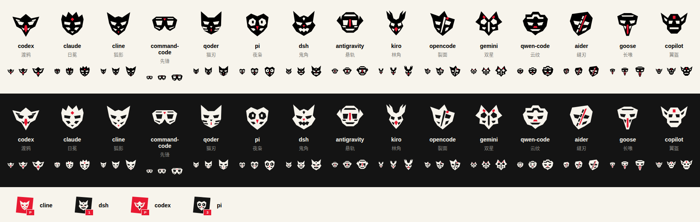

# Agent 面具标识 — 2026-10-05

平台能识别的 15 种客户端各有一张原创角形面具。标识由执行器 ID 决定，模型、角色、任务状态和列表顺序不会改变面具；cmd 与 command-code 使用同一张。未知客户端使用基于 ID 的稳定备用面具，备用面具有四种轮廓，可能共享轮廓，页面继续保留名称。

| Agent | 面具 |
|---|---|
| codex | 渡鸦 |
| claude | 日冕 |
| cline | 狐影 |
| cmd / command-code | 先锋 |
| qoder | 猫刃 |
| pi | 夜枭 |
| dsh | 鬼角 |
| antigravity | 悬轨 |
| kiro | 林角 |
| opencode | 裂面 |
| gemini | 双星 |
| qwen-code | 云纹 |
| aider | 缝刃 |
| goose | 长喙 |
| copilot | 翼盔 |

目录卡片、Planner 抬头和配置预览、Worker 编组与成员卡、任务归属、运行历史、交付队列、作者 / 评审与协作活动使用相同组件。Planner 草稿的选择立即更新配置预览；既有团队的抬头及 Reviewer 继续显示已保存的 Agent。P、R 与成员编号保持独立，多个相同 Agent 的 Worker 可通过编号识别。

消息依据 canonical from_run_id 与发送者匹配，使用当次 run 的执行器；缺少可核对的执行记录时保留文字。角色或配置更新不会改写旧消息身份。SVG 使用透明眼孔、继承当前前景色及少量红色强调，悬停与运行状态有轻微抬起和眼色反馈；减少动态效果时停用位移动画，高对比模式采用系统颜色。

这是前端标识资源。没有改变注册表、模型 / 思考强度元数据、鉴权、调度或派工行为，不引入图标库、网络字体或外部图片依赖。图鉴使用静态面具图案，浏览器界面验证使用受控客户端目录，不代表本机实际安装或可派工状态。
