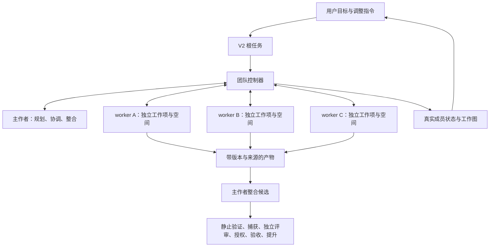

# 方案一：在 V2 作者阶段接入团队协作

日期：2026-10-01。状态：设计提案，尚未实施。对应目标：一个主作者组织多个 agents 完成同一目标，用户看得到分工，也能调整某个 worker 的工作方向。

## 1. 改动方向与理由

把现有 V2 的 `runAuthor` 扩展为团队执行入口：主作者负责拆分、协调和整合，多个 worker 分别执行工作项；团队整合后的候选继续经过现有 Trusted Import 交付流程。

这样可以较快补齐真实协作能力，保留已有执行器适配、独立评审、验收和提升链路。主作者仍对最终成果负责，但工作执行可以并行。该方案适合先交付一个目标内的完整团队协作，不把跨任务的长期团队管理作为首期范围。

当前缺口有直接依据：[V2 admission](../../lib/trusted-import/orchestrator-adapter.mjs) 明确拒绝多步骤计划；[V2 workflow](../../lib/workflows/v2.mjs) 只有一个作者回调；[collaboration](../../lib/collaboration.mjs) 的消息只针对根任务，在下一次 run/resume 前读取。旧流程已有 DAG 分批执行，但不是接通的 V2 团队能力。产品依据见[用户要求](V2-FRONTEND-REQUIREMENTS.md)。

## 2. 最小数据与控制模型

| 对象 | 必需内容 | 作用 |
| --- | --- | --- |
| 根任务 | `task_id`、目标、约束、`goal_revision`、`team` | 目标、团队进展与交付的关联 |
| 成员 | `agent_id`、角色、执行器、当前工作项、session 引用 | 可单独观察和调整的逻辑身份 |
| 工作项 | `work_item_id`、依赖、负责人、输入/输出约定、允许路径、`revision` | 并行、阻塞、重新分工与结果校验 |
| 执行尝试 | `run_id`、成员/工作项引用、owner token、进程 scope、退出证据 | 与一次 CLI 调用对应；会话不等于成员 |
| 消息/指令 | ID、发送者、目标成员/工作项、期望版本、回执 | 点对点交流和人工调整 |
| 产物 | 内容哈希、基线、工作项版本、run 来源、验证结果 | 可靠交接和整合 |

根任务内的 `team` 是本方案的团队生命周期真源，由持锁的团队控制器串行更新。worker 不直接改根任务文件；只向受控入口提交消息、结果和产物。消息、产物及回执独立保存，任务记录引用它们，页面使用读投影。

执行 capsule 同时携带根 `task_id`、`agent_id`、`work_item_id`、`run_id` 和受控 runtime context。不通过字符串截断猜父子身份，也不把一个整任务的后台进程当作 worker agent。

## 3. 从拆分到交付的完整行为

1. 主作者给出结构化工作计划；控制器验证依赖无环、输入齐全、路径权限、执行器资格及预算。复用旧 DAG 的验证思路，不直接接入旧 worktree 执行路径。
2. 无依赖的工作项可同时派发。主作者完成一轮规划后释放模型执行槽位，由控制器等待 worker；不能让主作者占着唯一槽位等待同执行器的子任务。
3. 每个 worker 获得独立的物理投影/隔离空间和专用上下文包：根目标、接口约定、自己的任务、输入产物版本及相关消息。模型只能申请派发/通信，权限和资源由平台验证。
4. 成员可以向主作者或其他成员询问接口、请求输入、报告阻塞并回复。消息通过平台收件箱路由；需要改变任务分配时由主作者形成新版计划。适配器通过结构化响应或受控工具桥承载请求，不假定所有 CLI 都支持原生子 agents。
5. worker 写入进程停止并经 scope 验证后，控制器捕获不可变产物，绑定基线和工作项版本，再发布给依赖方。报告中的“已完成”不能代替进程和产物证据。
6. 主作者在单独候选空间整合产物。路径冲突、基线漂移和过期输入必须显式处理；不能把多个 worker 直接放进同一可写目录，也不能用共享 canonical Git 引用的 linked worktree 作为隔离边界。
7. 整合完成后逐个验证主作者、worker 及其子进程的退出证据，再进入现有捕获、评审、授权、验收与提升流程。需要扩展作者结果协议，不能伪造一份作者退出证据代表全队。
8. 评审绑定整合候选、产物清单和目标版本。`NEEDS_FIX` 由主作者定位到相关工作项，重跑受影响的依赖范围，再完整送审；根交付修复预算与成员尝试预算分别限制。

作者阶段允许多个成员选择同一种执行器，受真实并发额度约束；评审仍采用现有独立性规则。多作者参与后，交付评审执行器不得与参与候选写入的任何成员执行器重合；创建团队时保留评审执行器，派发和每次评审重试再次校验。

## 4. 用户怎样控制团队

- 给主作者发消息：调整整体目标或分工；给特定 worker 发消息：询问进展、补充约束、修改工作项方向。
- 普通消息在下一次安全检查点/运行轮次领取。当前 CLI 不支持实时注入时，页面明确显示等待领取。
- 若修改正在执行的工作项，控制器持久化指令，停止该成员的进程 scope，确认静止后增加工作项版本，再启动新尝试。其他无关 worker 继续；依赖旧输入的下游工作项失效并重新规划。
- 回执区分 `queued / received / applied / rejected`。只有新版任务或产物证据成立时标记 applied；命令 ID 用于去重，版本不匹配明确拒绝并返回最新状态。
- 送审后收到目标/方向修改，必须先作废旧候选及其评审、审批绑定，再返回团队执行；已经完成提升的成果通过新目标版本启动下一次交付。

前端必须展示目标、成员身份、工作图、真实运行状态、阻塞原因、产物及指令回执，并支持选择某个成员操作。视觉表现可以另选；不能用模拟 worker 或无依据的进度百分比代替后端事实。

## 5. 代码改动范围与实施顺序

| 范围 | 主要改动 |
| --- | --- |
| `lib/v2-service.mjs`、V2 admission | 创建团队配置；验证新的团队协议，继续拒绝未接通的旧多步骤执行 |
| `lib/workflows/v2.mjs`、Trusted Import adapter | 作者回调选择单作者或团队；逐成员退出证据；候选清单与目标版本绑定 |
| 新 `lib/team/` 模块 | 计划验证、成员/工作项管理、受控派发、产物交接；避免先拆大量抽象层 |
| execution manager、adapters、runtime guard | 根/成员/尝试身份贯通；全局槽位与熔断一致；真实执行资格校验 |
| collaboration、operator control、read model、HTTP API | 成员定向消息、调整指令、版本与回执、团队状态投影 |
| 前端 | 真实分工、成员详情、主作者指令和 worker 调整入口 |

实施按三个可验收里程碑推进：

1. **真实并行团队**：修复 Q1/Q2 并发归属和 Q3 取消覆盖，统一 Q4/Q5 context；交付一个主作者、三个注册 worker、有依赖的工作项与真实产物。
2. **可调整的协作**：接通成员通信、定向调整、停止后重启、过期产物拒绝及整合冲突；补齐 Q6/Q7 的清理与恢复资格问题。
3. **完整交付**：逐成员静止验证、整合结果绑定独立评审、定向返工、Q8 重试复核和 Q9 持久审批恢复；前端使用真实服务完成浏览器联调。

Q1–Q9 见[复检报告](../reviews/2026-10-01-v2-backend-recheck.md)。这些修复保障协作和交付，不替代团队功能的验收。

旧单作者任务沿用原协议；团队任务显式使用新 schema。重启先复核运行 scope 和指令/产物，再恢复对应工作项；不能直接把 RUNNING 清零重派。旧程序不认识团队协议时拒绝派发。回滚须停止新派发、确认全部团队写入进程静止并保留状态和证据。

## 6. 产品验收与局限

- 一个主作者和三个真实 worker 完成一个目标；额度允许时至少两个独立工作项同时运行，依赖方在正确产物版本发布后启动。
- worker A 能向 B 请求接口并收到回复；界面可看到谁负责什么、为什么等待及输出来源。
- 修改 A 的方向后，旧尝试结果被拒绝，无关的 B/C 继续运行；指令是否收到、是否落实有证据。
- 单成员失败可重新分配；两个输出修改同一位置时显式解决冲突，不能静默覆盖。
- 重启恢复已确认的产物和消息，不重复接受旧版本结果；不能确认已停的进程不得并行重跑。
- 整合候选通过独立评审、现有验收和唯一提升入口；送审后改目标不能沿用旧批准。
- 确定性交错测试覆盖归属/版本/指令；真实多执行器端到端和浏览器联调分别验证，不把模拟执行器测试当作真实协作证明。

成本相对较低，迁移范围可控。局限是团队仍挂在 V2 作者阶段，成员主要在单个根目标内活动；长期团队、跨目标协作及复杂动态任务网络继续扩展时，会越来越受根任务模型限制。若这些是平台长期核心，应选[方案二](MULTI-AGENT-PLAN-B-COLLABORATION-CORE.md)。
