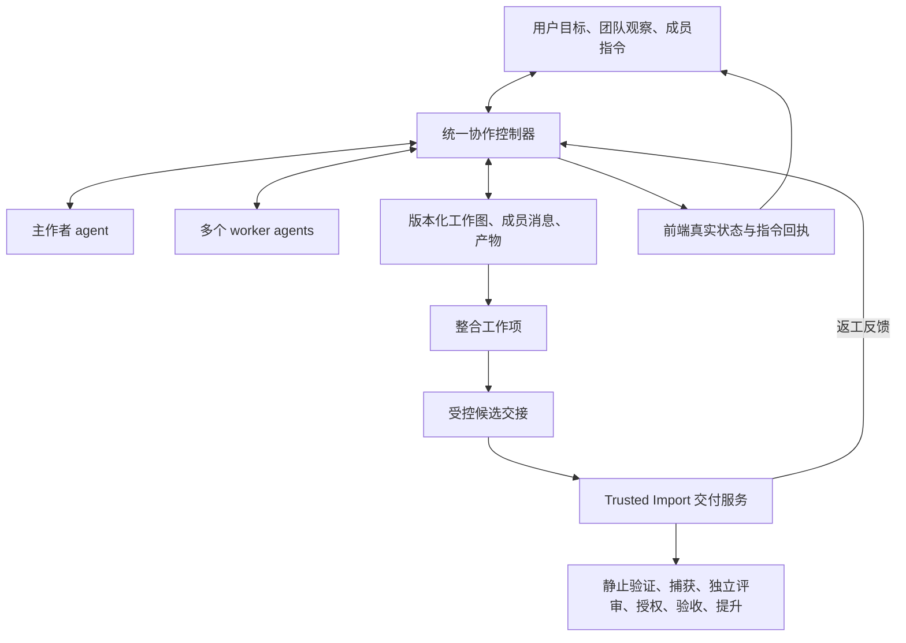

# 方案二：以团队协作为核心，Trusted Import 负责成果交付

日期：2026-10-01。状态：用户选择方案二；首期协作核心、团队入口与可信交付交接已实施，真实模型团队联调待验收。对应目标：多 agents 协作是平台的主体；主作者协调团队，用户能观察、沟通、调整成员和工作项，最终代码成果仍有可靠的交付路径。

实现入口为 [`lib/team/`](../../lib/team/)、[`af-team.mjs`](../../af-team.mjs) 与 [`web/teams.html`](../../web/teams.html)。下文保留总体设计；首期使用结构化响应路由成员消息与产物，未实施跨目标身份共享或模型运行中的实时工具注入。部署决策见 [ADR 0011](../adr/0011-team-collaboration-controller.md)，具体覆盖与验证边界见[实施记录](../reviews/2026-10-01-team-core-implementation.md)。

## 1. 改动方向与理由

把 Team、Agent、WorkItem、Message、Artifact 和 Run 建成平台的核心对象，围绕目标版本和工作依赖调度。现有 Trusted Import 改为交付服务，接收团队整合后的候选，负责独立评审、授权、验收和提升。

这样，产品主流程从“调用一个作者再调用 reviewer”变为“组织一个团队完成目标，再交付成果”。成员通信、动态分工、人工调整和失败后的协作恢复都有直接的数据与控制模型，更适合长期建设协作平台。

依据：[用户要求](V2-FRONTEND-REQUIREMENTS.md) 明确要求“单作者但不是单工作者”及 worker 定向调整；[现有 V2](../../lib/workflows/v2.mjs) 和 [admission](../../lib/trusted-import/orchestrator-adapter.mjs) 仍围绕单作者候选；[当前消息](../../lib/collaboration.mjs) 只在任务下一次 run/resume 时领取。旧 planner、DAG、执行器和交付能力可复用，但不能据此宣称当前 V2 已有团队控制。

## 2. 平台核心对象与职责

| 对象 | 主要内容 | 与当前设计的区别 |
| --- | --- | --- |
| Team/Goal | `team_id`、`goal_id`、项目、目标及版本、约束、预算、主作者、成员 | 以协作目标组织全过程 |
| Agent | `agent_id`、角色、能力、执行器绑定、session 引用、可用状态 | 成员身份可跨多次调用，角色不等于执行平台 |
| WorkItem | `work_item_id`、负责人、依赖、输入/输出、路径范围、版本、尝试预算 | 可创建、拆分、改派、阻塞和失效的工作节点 |
| Message/Command | ID、发送者、目标、对话关联、操作 ID、期望版本、回执 | 成员间交流与人工调整可追踪、可去重 |
| Artifact | `artifact_id`、不可变内容、哈希、来源、基线、工作项版本、验证记录 | 团队交接依据，不靠完整聊天记录共享上下文 |
| Run | `run_id`、成员/工作项/目标版本、实际执行器、scope、归属与退出证据 | 一次执行尝试，不作为逻辑成员身份 |
| Delivery | `delivery_id`、整合候选清单、目标版本、交付任务 ID、评审及提升证据 | 协作与可信代码交付之间有明确契约 |

主作者作规划、分工、协调和整合决策；平台控制器执行权限、版本、预算和资源校验。成员只能通过受控协议请求通信、提交产物或申请工作，不能因模型输出某个 ID 就取得运行/写入权限。CLI 原生子 agents 只有登记了身份、工作项和进程 scope 后，才计入平台团队。

普通 agent 可以在同一团队内承担多个工作项，或经授权加入其他目标；共享只读产物需要显式授权和版本引用。session 是否可恢复取决于适配器能力，不能把 session 当作唯一的 Agent 对象。

## 3. 统一控制、通信与人工调整

采用一个协作控制器统一受理 Web、CLI、主作者和 worker 的操作；每项操作验证身份、期望版本、去重 ID、权限、依赖及预算。新团队任务的派发、执行器槽位和状态提交只有一个控制入口；现有 scheduler/execution manager 迁为兼容入口或执行组件，不能保留两套可独立派发同一工作项的引擎。

首期在单机部署中由一个可重启的常驻控制进程负责收件箱、派发、回执和恢复；执行器进程继续隔离。控制进程持有租约和 owner token，旧实例失去归属后不能派发或提交结果。需要统一封闭旧 CLI 直接启动新团队任务的旁路，并验证旧控制器及其执行 scope 已停止后才能接管。

这是对历史“零独立 daemon”部署假设的明确调整，已在 ADR 0011 记录。首期增加一个本地协作控制进程，保持原子文件持久化，复用既有执行器与交付模块。[ADR 0005](../adr/0005-reject-sqlite-swap-fix-lock-coverage.md) 的数据库约束继续有效。

成员通过平台路由 `send_message / request_input / submit_artifact / report_blocked` 等受控请求，建立可追踪的对话。可由适配器结构化响应或工具桥承载；不同 CLI 的内部聊天不能直接当作公共消息总线。上下文包按工作项组织，包含目标、约束、输入产物版本和相关消息；成员不共享彼此的凭证环境。

用户既能调整主作者的整体规划，也能选择具体成员/工作项修改方向。指令持久化后返回 queued；送入某次执行后返回 received；只有可核对的新版工作项/产物证据才返回 applied。当前 CLI 不支持运行中注入时，采用安全检查点领取或停止 scope 后新建尝试。方向改变增加工作项版本，拒绝旧结果并使受影响下游失效；无关工作继续。

## 4. 产物整合与 Trusted Import 的边界

1. 每个 worker 在独立物理空间工作，不拥有 canonical/CAS 写权限。平台确认相关进程静止后捕获产物；输入、输出和结果都绑定目标/工作项版本与尝试来源。
2. 整合是一个明确工作项，由主作者负责决定怎样解决冲突；受控执行器在隔离候选空间落实。多个 worker 不共用可写候选，也不借 linked worktree 获得 canonical Git 引用写入能力。
3. 整合产物形成 DeliveryCandidate：基线 OID、目标版本、工作项/产物集合、内容摘要、全部写入 run 的 scope 及退出证据、可信策略引用。控制器只接受当前依赖闭合且版本一致的候选。
4. 新增受控候选交接协议，让 Trusted Import 验证来源并走静止验证、重新捕获、密封、独立评审、授权、验收与提升。不能接受 agent 自报的摘要/审批，也不能仅设置 `author_completed=true` 跳过作者边界。当前作者回调和单份退出证据协议需要适配多成员生产方。
5. 评审结果绑定整合后的候选与目标版本。沿用现有执行器独立性规则，并扩展校验到所有参与候选写入的成员：评审执行器不得与其中任何成员重合。团队派发时保留评审执行器，每次重试再次检查；不同 session 不能单独替代这一规则。
6. reviewer 要求返工时，交付服务返回带候选版本的反馈，由主作者更新相关工作项后重新交付；主作者规划不自动扩大权限，root 交付修复预算不能被新的成员尝试绕过。
7. 送审后改变目标或工作方向，控制器使候选及旧评审/批准失效；提升前必须复核当前目标版本、owner token 和 canonical old-OID。已完成提升后，新的调整进入下一目标版本。

团队状态表达规划、工作、阻塞和整合；Delivery 状态表达评审、授权、验收和提升。两者通过交付引用关联，各自只有一个写入者。团队的代码交付目标完成必须有成功提升证据，不能以 worker 全部返回作为完成证明。

## 5. 存储、恢复与迁移

首期仍可使用原子文件与顺序日志。团队变更写入带操作 ID 和序号的日志，快照标记已应用序号；恢复重放快照之后的已提交操作。团队状态由这套协议唯一确定；消息/产物是不可变事实，页面和旧任务展示只是读投影，不能另行修改团队生命周期。

执行槽位预留、工作项认领和启动意图由同一控制器持久提交；启动回执绑定认领 token，补偿和重放按操作 ID 去重。未知执行结果先检查 scope；没有确认退出的尝试不能直接重跑。这里保证状态及结果接受幂等，不承诺模型调用在崩溃时“恰好执行一次”。已有交付任务的策略哈希锚定、审批签名、审计脱敏和 CAS 提升约束继续验证。

迁移按三个里程碑推进，首期只做一个项目、一个团队、一个主作者和三个 worker：

1. **最小协作核心**：统一控制入口、目标/成员/工作项/尝试身份与版本、动态 DAG、真实并行；解决 Q1/Q2/Q3 及 Q4/Q5 context。旧单作者可作为单工作项导入新入口，旧历史继续可读。
2. **团队互动与整合**：成员通信、定向人工调整、失效传播、产物交接、冲突处理与恢复；Q6/Q7 在对应操作协议中补齐。前端联调可看到真实成员并操作指定工作项。
3. **可信交付闭环**：新候选交接、全成员静止证明、独立评审绑定、定向返工、Q8/Q9 的重试与审批恢复；同一真实目标完成到提升。

旧 V2 创建/启动 API 经兼容层路由；旧历史任务按原协议处理，新团队任务不能再由旧 scheduler 直接运行。旧 planner 的计划可以转成工作图后重新验证，不能复制旧执行器 worktree 边界。旧 task ID、提交记录与 Delivery ID 建立明确关联，避免丢失历史证据。

回滚先停止新派发，确认在途成员 scope 静止并导出当前事实；只有旧模型可表达的任务才能退回旧入口，不能假定旧代码可继续运行新团队。Q1–Q9 的范围和复现证据见[复检报告](../reviews/2026-10-01-v2-backend-recheck.md)。

## 6. 产品验收、成本与选择

- 真实主作者拆分目标，三个注册 worker 按依赖工作；额度允许时至少两个工作项确实并行，角色、执行平台与每次 run 可区分。
- 任意成员可请求其他成员提供接口/输入并接收版本化回复；主作者能新增、改派工作，平台检查权限和预算。
- 用户针对一个 worker 改方向，旧版本结果被拒绝、相关下游更新，无关成员继续；页面准确呈现回执和阻塞原因。
- 单成员失败、重复指令、整合冲突和控制器重启均有明确恢复行为；旧持有者不能提交结果或重复提升。
- 产物整合后完整进入 Trusted Import，评审反馈可形成定向返工；过期目标不能复用旧评审和审批。
- 真实浏览器能展示工作图、成员、产物、消息并执行调整；确定性测试、真实多执行器运行及浏览器验证分别提供证据。

相对[方案一](MULTI-AGENT-PLAN-A-V2-TEAM-STAGE.md)，改动成本更高：核心模型、控制入口、API、恢复和部署生命周期都要调整。回报是协作成为产品主体，复杂动态分工与持续团队不会持续挤进“作者阶段”的附属结构。

若长期目标明确是多 agents 协作平台，建议选择本方案。以最小团队闭环逐步实施，先证明成员真的协作、用户真的能调整、成果真的能交付，再扩展跨目标协作或评估存储规模。
