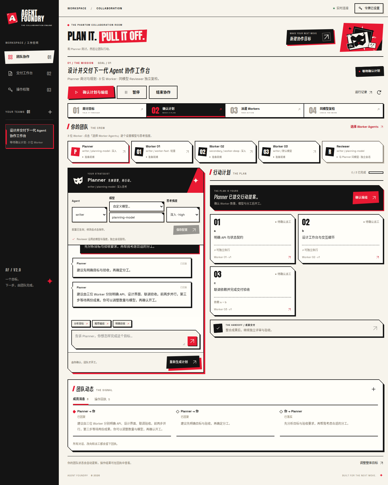
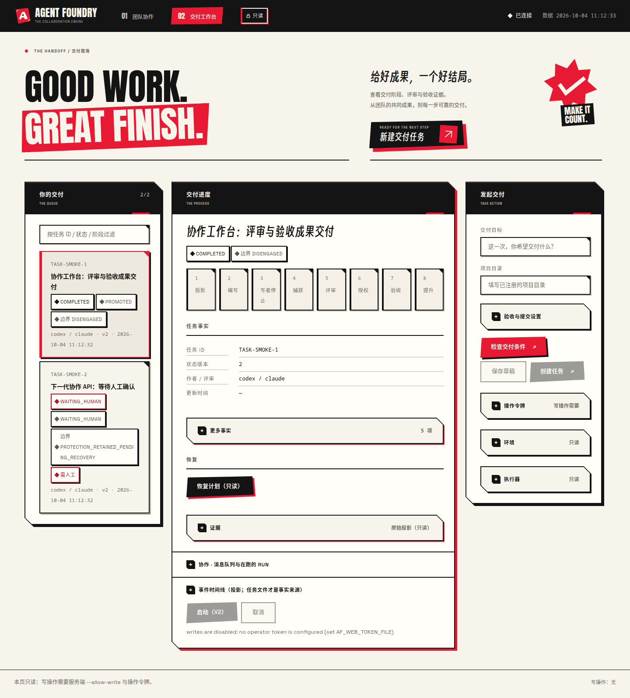

# Persona 协作空间

日期：2026-10-02。

以用户指定的 Persona 5 红黑白、斜切构图和怪盗漫画风为视觉方向，设计质量参考 [Awwwards](https://www.awwwards.com/) 与 [CSS Design Awards](https://www.cssdesignawards.com/about)。页面面向多 Agent 协作：一个目标、多个成员、可调整的行动计划，以及可追踪的交付。

## 页面与视觉

默认地址 `/` 进入 `/teams.html`。深色侧栏承载团队切换，纸白工作区承载真实状态。海报标题、斜切红色底块、网点、原创几何面具与 AF 标记构成视觉重点。业务卡片使用稳定网格，避免装饰影响阅读。

主流程是“选择 Planner 模型 → 聊天商讨 → 生成行动计划 → 确认 Worker 数量、模型与分工 → 开工 → 同模型独立会话复检”。创建时也可选择由 Planner 推荐编组后自动开工。左侧常驻真实 Planner 对话，右侧是提案、派工确认与工作项；动态和回执收在下方。已选择团队时缩小顶部海报，手机成员采用横向滚动。漫画对话气泡、斜切面具徽章、calling card、四步行动条与返工条加强 P5 视觉，也标记真实阶段。

- 点击 Planner 聚焦常驻对话框；点击 Worker，选择真实接收者并发送消息。
- Planner 面板常驻 Agent、模型与思考强度选单；“你的团队”旁的“选择 Worker Agents”逐位配置 Worker，创建前和商讨阶段即可预设。目录模型用下拉选单，自定义模型显示额外输入框；保存配置不会开工，未保存的 Planner 修改会阻止继续聊天或请求提案。
- 已开工的团队先暂停，全部执行范围停止后才能换配置；保留已接受成果，配置用于后续尝试。确认同时绑定配置版本，Reviewer 在交付时继承最新 Planner 配置并建立独立会话。
- 点击执行中的工作项，暂停旧尝试与受影响的依赖并提交反馈；Planner 改写后才重新派工。提交绑定打开编辑器时的版本，防止静默覆盖后续修改。
- 计划提案默认停在 `PLAN_READY`；编组窗口允许 1–8 位 Worker、相同或不同的执行器/模型以及逐项分配。确认绑定计划版本和目标版本。
- Reviewer 与 Planner 的模型配置一致，但建立独立会话；拒绝缺失身份或与任一 Planner/Worker 会话冲突的复检。
- 主按钮根据真实阶段显示启动、恢复、协作中或继续交付。
- 成员消息与操作回执支持键盘切换。
- 输入错误显示在当前弹窗，保留已填写的草稿。
- 手机端使用单列布局；收起的导航不参与键盘焦点，展开导航时背景不可操作，Escape 关闭并恢复焦点。
- 动画采用 transform、opacity 与颜色过渡，遵循 `prefers-reduced-motion`。

交付工作台位于 `/workbench.html`，同步采用黑色导航、纸白卡片、红色海报和统一按钮。它保留原有 12 列 / 8pt 布局、八阶段进度、任务证据、恢复计划与鉴权操作。验收参数及提交标识收进展开设置；自动标识随草稿修改更新，相同草稿重试保留标识，手工标识由用户控制。验证失败时展开相关字段。手机任务队列可以单独滚动，避免长列表将详情推到页面末端。历史 `/#TASK-*` 书签继续转到该页面。

## 字体与按钮

选字参考 [Awwwards 的 Anton 字体筛选](https://www.awwwards.com/websites/art/) 与 [CSS Design Awards 的 Stelvio Grotesk 字体展示](https://www.cssdesignawards.com/woty2020/sites/stelvio-grotesk)。以下组合是根据 Persona 海报气质和工作台阅读需求做出的设计选择；正文借鉴清晰的 grotesk 排版方向。

| 使用位置 | 字体 | 选择理由 |
|---|---|---|
| 英文海报与编号 | [Anton](https://github.com/google/fonts/tree/main/ofl/anton) | 紧凑、厚重，强化红黑白海报的视觉重心 |
| 英文界面与数字 | [Space Grotesk](https://github.com/floriankarsten/space-grotesk) | 几何形态与清晰字腔，适合按钮和状态信息 |
| 中文标题、主要 CTA | [得意黑 Smiley Sans](https://github.com/atelier-anchor/smiley-sans) | 窄斜字身与手绘细节呼应怪盗漫画风；仅用于短标题与大字号按钮 |
| 中文正文 | Noto Sans CJK SC / 苹方 / 微软雅黑 | 保持长句和小字号信息的阅读清晰度 |

两个页面通过 `foundry-theme.css` 共用字体与交互样式。主要 CTA 使用斜切黑色前板、红色错位底板、小标题与独立箭头板；主要操作使用红色前板和黑色底板；次要操作使用纸白描边。悬停抬起前板，按下时前板与底板合拢。焦点轮廓保留在裁切图形外，禁用状态撤去底板，减少动画模式禁用位移动画。

## 全站边框

`foundry-frames.css` 在两页最后加载，统一面板、成员卡片、工作项、聊天区、动态、编组卡片、交付设置、输入框、证据和全部 7 个弹窗。大面板采用黑色连续描边、右上和左下斜切角、跟随轮廓的错位底板；Planner 与交付主面板使用红色底板。选中、执行和挂起状态继续保留独立的文字标记与红色强调。空状态使用浅色网纹，避免影响正文阅读。

裁切施加在装饰底层，保留实际内容与焦点区域。输入框保持完整文字区域和原生下拉选单，通过角标、描边和焦点反馈呼应漫画面板。弹窗保留原生顶层、焦点约束与滚动，在框角、标题分隔和错位底板上加强视觉。高对比模式撤去装饰层、恢复系统边框。交付队列中的卡片禁止压缩，长状态可换行，队列自身滚动。

## 预览

协作流程截图来自真实 Chromium、HTTP 服务与协作控制器，模型输出使用受控测试适配器。新增空态与手机创建视口截图来自当前只读本地预览。



[查看手机长图](../previews/persona-workspace/planner-mobile.png) · [手机编组窗口](../previews/persona-workspace/planner-dispatch-mobile.png) · [暂停并通知 Planner](../previews/persona-workspace/planner-rework-desktop.png)

[简化后的创建页](../previews/persona-workspace/planner-create-desktop.png) · [手机模型与思考强度选择](../previews/persona-workspace/planner-create-mobile.png)

[常驻 Planner 配置](../previews/persona-workspace/planner-config-desktop.png) · [逐位 Worker 配置](../previews/persona-workspace/worker-config-desktop.png) · [手机 Worker 配置](../previews/persona-workspace/worker-config-mobile.png)

[尚未创建团队时的完整边框](../previews/persona-workspace/teams-empty-desktop.png) · [手机创建弹窗视口](../previews/persona-workspace/create-dialog-viewport.png)

创建入口只保留目标、项目和 Planner 的 Agent / 模型 / 思考强度。Worker 人数默认在计划确认时选择，也可提前通过独立配置入口预设；开工授权、验收参数与提交标识收进“更多设置”。模型和强度联动：切换 Agent 清除不兼容覆盖，没有思考等级的模型禁用强度覆盖。手机端底部主按钮保持可见。Reviewer 沿用 Planner 配置并开启独立会话。



[查看交付工作台手机长图](../previews/persona-workspace/workbench-mobile.png)

## 验证

运行：

```bash
node qa/planner-browser.mjs --output-dir /tmp/af-planner-browser
node qa/team-browser.mjs --output-dir /tmp/af-persona-browser
node verification/web-console-smoke.mjs
node verification/web-write-browser.mjs
node verification/deploy-preflight.mjs
node --test tests/team-agent-configuration.test.mjs tests/team-planner.test.mjs tests/team-api.test.mjs tests/web-api-readonly.test.mjs tests/web-api-write-auth.test.mjs tests/web-style-scale.test.mjs
```

- 协作页 Chromium 验证 23 项行为：默认入口、历史任务书签、鉴权操作、成员和依赖、消息回执与转义、定向调整、无关产物保留、旧结果拒绝、刷新恢复、桌面网格、手机导航与焦点、新建弹窗、错误草稿保留、键盘标签、本地字体、中文标题与正文排版、斜切按钮、响应式与减少动画，以及浏览器创建时 Planner 配置落库与 Reviewer 配置绑定。
- Planner 页 Chromium 验证 36 项行为，覆盖真实聊天、消息转义、确认前不派工、计划后修改人数、不同执行器与模型、逐项分配、暂停、Planner 改写、下游挂起、旧结果拒绝、无关成果保留、重载与手机编组窗口；包括简洁创建、常驻 Planner 配置保存、商讨阶段的 Worker 配置、模型下拉与自定义、执行器和模型的强度限制，以及真实执行请求中的 Planner / Worker 强度。
- 新流程覆盖 320–1920px，无页面横向溢出；成员列表在手机端可单独横向滚动。
- Planner 后端检查覆盖手动与自动派工、复检新会话、版本冲突、计划与改向的重启恢复，以及无关定义保护。既有团队链路继续回归。
- 新增 Agent 配置后端检查 6/6 通过：保存不派工、模型与强度传入执行、最新 Reviewer 绑定、非法配置拒绝、版本冲突和重启恢复、暂停后换配置保留无关成果，以及预设人数约束。完整测试 825 项：822 通过、3 跳过、0 失败。
- 交付页浏览器检查：只读 30/30、写操作 22/22 通过，覆盖本地字体、同款按钮、真实 CTA 点击、提交标识、只读预检、设置错误展开、任务创建/启动/取消、消息队列、令牌与响应式布局；320–1440px 的较长状态信息保留在卡片内。
- 当前只读预览专项复检：90/90 通过，检查创建前 Planner 选择与创建弹窗同步、Worker 草稿保存并重开、320–1920px 配置布局，全部 7 个原生弹窗的边界、焦点与滚动，高对比和减少动画模式，以及长交付卡片的高度与换行。只修改页面草稿和长状态 DOM 样例，未调用写接口。此为专项复检记录，工作流的自动回归仍由上面的脚本覆盖。
- 部署静态预检：46/46 通过，覆盖两页资源、共享边框样式、字体许可与控制项。该预检检查部署输入，不等同于系统服务安装或真实模型验收。
- 原始浏览器结果：[Planner 页](../previews/persona-workspace/planner-report.json)、[既有协作链路](../previews/persona-workspace/report.json)、[交付页](../previews/persona-workspace/workbench-report.json)。
- 边框复检记录：[两页、全部弹窗与可访问性](../previews/persona-workspace/frame-review.json)。

## 资源

使用原生 HTML、CSS、JavaScript 和 SVG，无新增运行时依赖。图形与图标为仓库内矢量资源；字体本地加载，分别保留 [Anton](../../web/fonts/Anton-OFL.txt)、[Space Grotesk](../../web/fonts/SpaceGrotesk-OFL.txt) 与[得意黑](../../web/fonts/SmileySans-OFL.txt)的 SIL Open Font License。页面不请求外部字体或图片。
