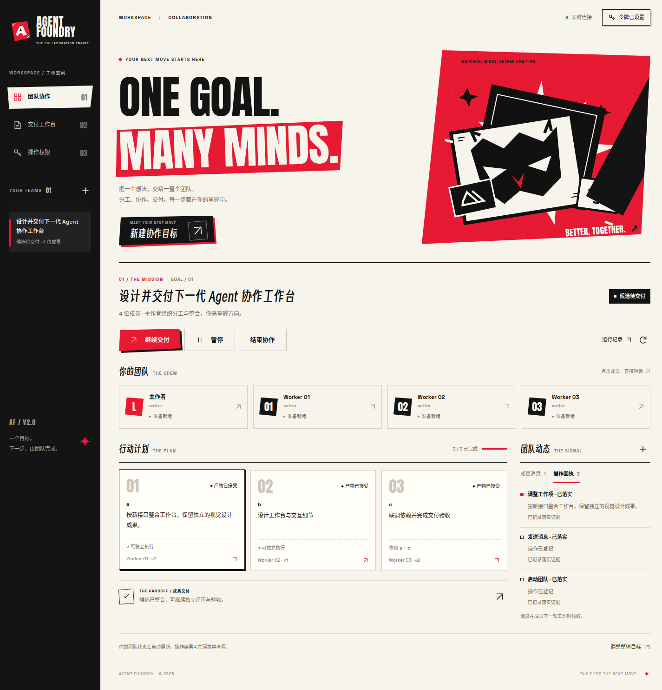

# Persona 协作空间

日期：2026-10-02。

以用户指定的 Persona 5 红黑白、斜切构图和怪盗漫画风为视觉方向，设计质量参考 [Awwwards](https://www.awwwards.com/) 与 [CSS Design Awards](https://www.cssdesignawards.com/about)。页面面向多 Agent 协作：一个目标、多个成员、可调整的行动计划，以及可追踪的交付。

## 页面与视觉

默认地址 `/` 进入 `/teams.html`。深色侧栏承载团队切换，纸白工作区承载真实状态。海报标题、斜切红色底块、网点、原创几何面具与 AF 标记构成视觉重点。业务卡片使用稳定网格，避免装饰影响阅读。

主流程是“创建目标 → 启动团队 → 查看成员与计划 → 调整工作项 → 继续交付”。新建、权限、成员消息、定向调整、整体目标与运行记录使用原生 dialog，默认界面只显示当前目标、成员、计划与动态。

- 点击成员，选择真实接收者并发送消息。
- 点击工作项，修改方向或改派；提交绑定打开编辑器时的版本，防止静默覆盖后续修改。
- 主按钮根据真实阶段显示启动、恢复、协作中或继续交付。
- 成员消息与操作回执支持键盘切换。
- 输入错误显示在当前弹窗，保留已填写的草稿。
- 手机端使用单列布局；收起的导航不参与键盘焦点，展开导航时背景不可操作，Escape 关闭并恢复焦点。
- 动画采用 transform、opacity 与颜色过渡，遵循 `prefers-reduced-motion`。

交付工作台位于 `/workbench.html`，同步采用黑色导航、纸白卡片、红色海报和统一按钮。它保留原有 12 列 / 8pt 布局、八阶段进度、任务证据、恢复计划与鉴权操作。验收参数及提交标识收进展开设置；自动标识随草稿修改更新，相同草稿重试保留标识，手工标识由用户控制。验证失败时展开相关字段。手机任务队列可以单独滚动，避免长列表将详情推到页面末端。历史 `/#TASK-*` 书签继续转到该页面。

## 字体与按钮

选字参考 [Awwwards 的 Anton 字体筛选](https://www.awwwards.com/websites/art/) 与 [CSS Design Awards 的 Stelvio Grotesk 字体展示](https://www.cssdesignawards.com/woty2020/sites/stelvio-grotesk)。以下组合是根据 Persona 海报气质和工作台阅读需求做出的设计选择；正文借鉴清晰的 grotesk 排版方向。

| 使用位置 | 字体 | 选择理由 |
|---|---|---|
| 英文海报与编号 | [Anton](https://github.com/google/fonts/tree/main/ofl/anton) | 紧凑、厚重，强化红黑白海报的视觉重心 |
| 英文界面与数字 | [Space Grotesk](https://github.com/floriankarsten/space-grotesk) | 几何形态与清晰字腔，适合按钮和状态信息 |
| 中文标题、主要 CTA | [得意黑 Smiley Sans](https://github.com/atelier-anchor/smiley-sans) | 窄斜字身与手绘细节呼应怪盗漫画风；仅用于短标题与大字号按钮 |
| 中文正文 | Noto Sans CJK SC / 苹方 / 微软雅黑 | 保持长句和小字号信息的阅读清晰度 |

两个页面通过 `foundry-theme.css` 共用字体与交互样式。主要 CTA 使用斜切黑色前板、红色错位底板、小标题与独立箭头板；主要操作使用红色前板和黑色底板；次要操作使用纸白描边。悬停抬起前板，按下时前板与底板合拢。焦点轮廓保留在裁切图形外，禁用状态撤去底板，减少动画模式禁用位移动画。

## 预览

下面的截图来自真实 Chromium、HTTP 服务与协作控制器，模型输出使用受控测试适配器。



[查看手机长图](../previews/persona-workspace/team-mobile.png)


[查看交付工作台手机长图](../previews/persona-workspace/workbench-mobile.png)

## 验证

运行：

```bash
node qa/team-browser.mjs --output-dir /tmp/af-persona-browser
node verification/web-console-smoke.mjs
node verification/web-write-browser.mjs
node verification/deploy-preflight.mjs
node --test tests/team-api.test.mjs tests/web-api-readonly.test.mjs tests/web-api-write-auth.test.mjs tests/web-style-scale.test.mjs
```

- 协作页 Chromium 验证 21 项行为：默认入口、历史任务书签、鉴权操作、成员和依赖、消息回执与转义、定向调整、无关产物保留、旧结果拒绝、刷新恢复、桌面网格、手机导航与焦点、新建弹窗、错误草稿保留、键盘标签、本地字体、中文标题与正文排版、斜切按钮、响应式与减少动画。
- 视口覆盖 360、390、768、1024、1440、1920px，无横向溢出。
- 相关 API 与工作台回归：24/24 通过。
- 交付页浏览器检查：只读 30/30、写操作 22/22 通过，覆盖本地字体、同款按钮、真实 CTA 点击、提交标识、只读预检、设置错误展开、任务创建/启动/取消、消息队列、令牌与响应式布局；320–1440px 的较长状态信息保留在卡片内。
- 部署静态预检：44/44 通过，覆盖两页资源、字体许可与控制项。该预检检查部署输入，不等同于系统服务安装或真实模型验收。
- 原始浏览器结果：[协作页](../previews/persona-workspace/report.json)、[交付页](../previews/persona-workspace/workbench-report.json)。

## 资源

使用原生 HTML、CSS、JavaScript 和 SVG，无新增运行时依赖。图形与图标为仓库内矢量资源；字体本地加载，分别保留 [Anton](../../web/fonts/Anton-OFL.txt)、[Space Grotesk](../../web/fonts/SpaceGrotesk-OFL.txt) 与[得意黑](../../web/fonts/SmileySans-OFL.txt)的 SIL Open Font License。页面不请求外部字体或图片。
