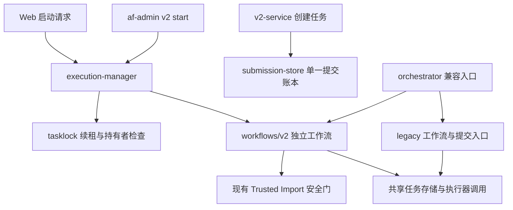

# V2 后端方案二实施记录

日期：2026-09-30。仓库：`agent-foundry-next`。重构基线：`main@07c3a4c`。

本次按“围绕 V2 主流程重组后端”的方案实施：拆开工作流，统一提交身份、执行归属、策略和数据路径。沿用文件存储与现有 Trusted Import 安全门。旧任务、旧版治理流程和公开入口继续兼容。

原始问题和复现记录见 [V2 后端冗余检查](2026-09-30-v2-backend-redundancy.md)。该报告中的行号和行为描述对应重构前的基线。

2026-10-01 复检补充：[后端复检报告](2026-10-01-v2-backend-recheck.md) 确认 9 项仍未修复的问题，包括跨进程护栏、锁初始化、旧 run 取消保护、Human Gate 恢复以及目录和兼容调用遗漏。下文描述的是已实施的收敛工作，涉及取消终态、完整路径贯通和绑定记录删除保护的结论，应结合复检报告中的范围修正阅读。

## 最终调用结构



`orchestrator.mjs` 从 1,861 行降到 547 行，保留 API 分流和旧命令行入口。执行器调用、工作流状态处理、旧版规划与治理实现已移到职责明确的模块。这里减少的是入口耦合，不代表整个后端删除了同样数量的代码。

## 改动及理由

| 原问题 | 实施结果 | 理由 |
| --- | --- | --- |
| R1：重复管理执行归属 | V2 Web/CLI 统一进入 `execution-manager.mjs`；V2、Scheduler、恢复和旧 CLI 共用 `maintainTaskLease()` | 消除长任务无续租和 Web 接管前重复派发的问题 |
| R2：三套执行器资格判断 | 创建、路由、selector 共用 `executor-eligibility.mjs` | 禁用、不可调度、能力、可用性和熔断规则由一处维护；优先顺序仍可按入口配置 |
| R3：两套验收白名单 | `acceptance-policy.mjs` 统一加载、配置路径和匹配；旧 loader 接口保留适配 | 提交检查和执行前复核使用同一规则，继续保留两次检查 |
| R4：两份幂等账本 | `submission-store.mjs` 统一 key、内容摘要、创建阶段和 task 绑定 | 同一键更换内容会被拒绝；创建中断可用同一 task ID 恢复 |
| R5：两处修复预算 | `v2-task.mjs` 规范化旧记录；V2 预算写入实际读取的 `trusted_import.max_revisions` | 避免创建参数失效，区分修复次数与作者修订号 |
| R6：路径各自拼接 | 共享 `data-roots.mjs`；创建使用项目目录分配器；worker 显式继承 tasks/locks/runtime | 项目 workspace 配置生效，自定义 runtime 下消息和接收回执保持一致 |
| R7：重复原子写入 | `writeJsonAtomic()` 统一任务、提交、协作和工作台的 JSON 写入 | 共用 fsync、临时文件清理和故障处理，同时保留首次发布不覆盖语义 |
| R8：V1/V2 混在大入口 | V2 直接进入 `workflows/v2.mjs`；旧流程放在 `legacy/`；共用执行器结果绑定和持久化 | V2 不再借道旧 `continueTask()` 工作流，兼容功能有明确边界 |

没有依据“只被测试引用”删除安全能力。原先未被主链路使用的项目目录分配器已接入创建；其余已有公开工具继续保留，以避免无证据的兼容破坏。

## 执行归属与派发契约

Web 启动先在任务锁内记录 `task.execution.status = DISPATCHED` 和唯一 `operation_id`，然后释放短锁、启动 detached worker。worker 持同一操作 ID 接管并记录 `RUNNING`，在整个工作流期间持锁、续租，完成后写入执行回执。

未接管的有效请求也会阻止第二次启动，返回 HTTP 409。派发失败记录为 `DISPATCH_FAILED`，可重试。默认接管期限为 60 秒；超过期限的新启动会替换旧请求，旧操作 ID 不能接管新请求。

每次取锁新增独立 `owner_token`。即使进程复用了相同的 instance ID，旧的一次取锁也不能续租或释放新锁。任务生命周期写入、执行器调用边界和 V2 更新 ref 前检查归属；失锁的持有者不再写入任务结果。

HTTP 202 的 `outcome` 从原来的 `started` 改为 `dispatched`，明确表示派发已接受。执行状态以持久化的工作进程回执和任务生命周期为准，202 不表示任务已经完成。现有浏览器调用不依赖原来的 outcome 字面值；新增测试检查了待接管期间的重复启动。

`allow_failed_reentry` 经派发记录传递给 worker。FAILED 仍需明确授权才能重入，CANCELLED 和 COMPLETED 保持终态，WAITING_HUMAN 仍需解决既有 Human Gate。

现有 Scheduler 继续承担旧接口的排队和重试；本次统一的是 V2 启动归属及各入口共用的锁租约。没有引入常驻执行池或新的全局队列。

## 提交、旧记录与预算

新提交只生成 `<key-digest>.json`，阶段为 `PREPARED → CREATING → TASK_CREATED`。它保存规范化 capsule 摘要、profile/scope 请求身份和 task 绑定。任务运行状态及派发回执保存在 task 文件中，提交账本不复制任务生命周期。

先持久化分配的 task ID，再创建 workspace 和 task，最后确认 `TASK_CREATED`。中断后重试沿用分配的 ID；如果 task 已写入而账本尚未确认，则补齐账本。测试覆盖了缺失 task 的创建中断和旧 binding 的采用。

旧 `<key-digest>.task.json` 仍可读取。创建服务检查其原任务内容、范围和验收 profile，然后将绑定写入统一账本，保留原 task ID。旧文件不自动删除。旧记录若没有保存本次重试提交的 context/source 等信息，不能猜测二者相同，会拒绝不一致的重试。

V2 的 `trusted_import.max_revisions` 表示最多允许的修复次数，0 表示仅执行初始作者版本。`trusted_import.revisions_used` 是已消耗修复次数；顶层 `revisions_used` 保留作者修订号的原语义。顶层 `max_revisions` 作为兼容投影保留，旧记录缺少嵌套预算时采用顶层值。

只有已经持久化并扣减预算的 `TRUSTED_IMPORT_NEEDS_FIX_RETRY` 自动重入完整安全门。其他失败不自动重入。新的工作流测试验证了第一轮 NEEDS_FIX、第二轮 PASS 后完成，以及零预算时不会第二次调用作者。

## 验收与路径的兼容变化

验收命令按完整命令身份和参数前缀匹配。当前 Node 进程的 `process.execPath` 可以对应白名单中的 `node`；其他完整路径必须明确配置在白名单中，不再仅凭 basename 获得权限。非法白名单条目使整个策略拒绝执行，提交和执行使用相同解析结果。

数据根目录统一解析，默认位置以本仓库为基准；显式环境变量和注入目录继续支持。项目 `workspace_root` 现在用于分配 candidate/CAS。Web 不再采用请求体中的 `submissions_dir`，提交目录由服务端配置决定。

协作消息、接收回执、工作台状态，以及 worker 的运行记录使用同一 runtime 配置。worker 启动参数和环境均传递实际的数据根目录，避免浏览器服务与工作进程各自推导路径。

首次发布使用不覆盖写入；普通更新继续使用原子替换。已绑定任务的提交记录不能通过 `forgetSubmission()` 删除，避免遗失幂等身份。

## 验证

最终执行：

```sh
node --test --test-reporter=spec
```

结果：**769 项测试，766 通过、0 失败、3 跳过**。`git diff --check` 通过。完整测试输出保存在 `/tmp/af-v2-scheme2-tests.log`。

新增行为测试覆盖续租超过初始租约、相同 instance ID 的旧锁失效、失锁后拒绝写入、待接管请求互斥、派发失败重试、过期请求替换、失败授权传递、单一账本、创建中断恢复、旧 binding 采用、执行器资格、消息目录、原子首次发布、修复预算，以及旧 CLI 的实际恢复/取消/取锁行为。

旧版治理、Human Gate 关联、并行 Worktree、恢复、防伪验收、取消边界、Trusted Import 各阶段和 Web 鉴权测试继续通过。

三个跳过项沿用原套件的显式开关：两个 Docker 部署验收用例，以及一个真实执行器 recovery probe 用例。因此本次结果不代表已经完成 Docker 部署或真实模型任务的端到端验收。

本次仅修改工作区代码和上述记录，没有部署或提交 Git commit。用户正在新增的前端设计文件与 prototypes 保持原状。
